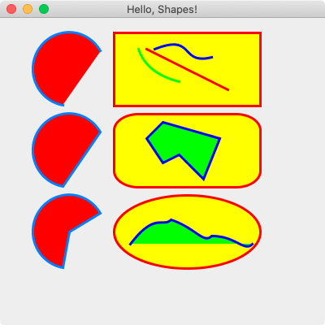

# [](https://github.com/AndyObtiva/glimmer) Glimmer DSL for Swing 0.0.5
## JRuby Swing Desktop Development GUI Library
[](http://badge.fury.io/rb/glimmer-dsl-swing)
[](https://gitter.im/AndyObtiva/glimmer?utm_source=badge&utm_medium=badge&utm_campaign=pr-badge&utm_content=badge)

[Glimmer](https://github.com/AndyObtiva/glimmer) DSL for [Swing](https://docs.oracle.com/javase/tutorial/uiswing/) enables building desktop applications with [Java Swing](https://docs.oracle.com/javase/tutorial/uiswing/), [Java AWT](https://docs.oracle.com/javase/8/docs/technotes/guides/awt/index.html), [Java Foundation Classes](https://docs.oracle.com/javase/tutorial/uiswing/start/about.html) and [Java 2D](https://docs.oracle.com/javase/tutorial/2d/index.html) via [JRuby](https://www.jruby.org/).

There has been a great divide between two big GUI toolkits in Java:
- [Eclipse SWT](https://www.eclipse.org/swt/)
- [Java Swing/AWT/JFC/2D](https://docs.oracle.com/javase/tutorial/uiswing/)

[Glimmer](https://github.com/AndyObtiva/glimmer) intentionally avoided [Swing](https://docs.oracle.com/javase/tutorial/uiswing/)-like GUI toolkits in the past because they produced non-native looking graphical user interfaces that not only looked out of place in various operating systems, but also degraded usability, user experience, and the professional look of applications significantly, especially given that unlike [SWT](https://www.eclipse.org/swt/), [Swing](https://docs.oracle.com/javase/tutorial/uiswing/) performance is affected by [Java Garbage Collection](https://docs.oracle.com/javase/8/docs/technotes/guides/troubleshoot/performissues003.html) pauses. As such, [Glimmer DSL for SWT](https://github.com/AndyObtiva/glimmer-dsl-swt) was initially born as the premiere [Glimmer](https://github.com/AndyObtiva/glimmer) DSL.

That said, from a balanced software engineering point of view, there are sometimes non-functional requirements that might target [Swing](https://docs.oracle.com/javase/tutorial/uiswing/) as an appropriate GUI toolkit solution. Like in the case of extending legacy [Swing](https://docs.oracle.com/javase/tutorial/uiswing/) applications or developing rare applications that require fully custom looking graphical user interfaces (typically not recommended), such as traffic control planning or diagramming applications. In the latter case, it would not matter whether to use [SWT](https://www.eclipse.org/swt/) or [Swing](https://docs.oracle.com/javase/tutorial/uiswing/) as they both provide support for building non-native components (in addition to native widgets in the case of [SWT](https://www.eclipse.org/swt/)).

[Glimmer DSL for Swing](https://rubygems.org/gems/glimmer-dsl-swing) aims to supercharge productivity and maintainability in developing [Swing](https://docs.oracle.com/javase/tutorial/uiswing/) applications by providing a DSL similar to [Glimmer DSL for SWT](https://github.com/AndyObtiva/glimmer-dsl-swt) having:
- [Declarative DSL syntax](#glimmer-gui-dsl) that visually maps to the GUI component hierarchy
- Convention over configuration via [smart defaults and automation of low-level details](#smart-defaults-and-conventions)
- Requiring the least amount of syntax possible to build GUI
- Custom Keyword support
- Bidirectional Data-Binding to declaratively wire and automatically synchronize GUI with Business Models
- Scaffolding for new custom components, apps, and gems
- Native-Executable packaging on Mac, Windows, and Linux.

Hello, World!


```ruby
jframe('Hello, World!') {
  jlabel('Hello, World!')
}.show
```

NOTE: Glimmer DSL for Swing is currently in early alpha mode (incomplete proof-of-concept). If you want it developed faster, then [open an issue report](https://github.com/AndyObtiva/glimmer-dsl-swing/issues/new). I have completed some GitHub project features much faster before due to [issue reports](https://github.com/AndyObtiva/glimmer-dsl-swing/issues) and [pull requests](https://github.com/AndyObtiva/glimmer-dsl-swing/pulls). Please help make better by contributing, adopting for small or low risk projects, and providing feedback. It is still an early alpha, so the more feedback and issues you report the better.Please help make better by contributing, adopting for small or low risk projects, and providing feedback. It is still an early alpha, so the more feedback and issues you report the better.

Learn more about the differences between various [Glimmer](https://github.com/AndyObtiva/glimmer) DSLs by looking at the **[Glimmer DSL Comparison Table](https://github.com/AndyObtiva/glimmer#glimmer-dsl-comparison-table)**.

## Prerequisites

- JDK 8 (find at https://www.oracle.com/java/technologies/downloads/#java8)
- [RVM](http://rvm.io) on Mac & Linux (not available on Windows)
- JRuby 9.2.19.0 (supporting Ruby 2.5.x syntax) (get via [RVM](http://rvm.io) on Mac and Linux by running `rvm install jruby-9.2.19.0`; On Windows, find at [https://www.jruby.org/download](https://www.jruby.org/download))

Note: On the Mac, if you have [Glimmer DSL for SWT](https://github.com/AndyObtiva/glimmer-dsl-swt) installed, and it added `export JRUBY_OPTS="$JRUBY_OPTS -J-XstartOnFirstThread"` to your `.zprofile`, `.zshrc`, `.bash_profile`, or `.bashrc`, make sure to disable it before using Glimmer DSL for Swing. Unfortunately, it is not compatible with it and will hang its apps until disabled.

## Setup

### Option 1: Install

Run this command to install directly:
```
gem install glimmer-dsl-swing -v0.0.5
```

### Option 2: Bundler

Add the following to `Gemfile`:
```
gem 'glimmer-dsl-swing', '0.0.5'
```

And, then run:
```
bundle
```

## Usage

Require the library and mixin the `Glimmer` module to utilize the Glimmer GUI DSL for Swing:

```ruby
require 'glimmer-dsl-swing'

include Glimmer

jframe('Hello, World!') {
  jlabel('Hello, World!')
}.show
```

For actual application development outside of simple demos, mixin the `Glimmer` module into a custom application class instead:

```ruby
require 'glimmer-dsl-swing'

class SomeApplication
  include Glimmer

  def launch
    jframe('Hello, World!') {
      jlabel('Hello, World!')
    }.show
  end
end

SomeApplication.new.launch
```

## Glimmer GUI DSL

The Glimmer GUI DSL enables development of desktop graphical user interfaces in a manner similar to HTML, but in one language, Ruby, thus avoiding the multi-language separation dissonance encountered on the web, especially given that Ruby looping/conditional constructs do not need scriptlets to be added around View code. This makes desktop development extremely productive.

1 - Keywords

You may declare any [swing](https://docs.oracle.com/javase/8/docs/api/javax/swing/package-summary.html)/[awt](https://docs.oracle.com/javase/8/docs/api/java/awt/package-summary.html) component with its keyword, which is the underscored version of the class name. For example, `jframe` is the keyword for `javax.swing.JFrame` (`j_frame` is acceptable too)

Examples:

```ruby
jframe
jbutton
jlabel
```

2 - Arguments

You may pass any arguments that a [swing](https://docs.oracle.com/javase/8/docs/api/javax/swing/package-summary.html)/[awt](https://docs.oracle.com/javase/8/docs/api/java/awt/package-summary.html) component constructor accepts to its Glimmer keyword.

Example (`JFrame`, `JButton`, and `JLabel` have a constructor signature that accepts a string representing title or text):

```ruby
jframe('Hello, World!')
jbutton('Push Me')
jlabel('Name')
```

The recommended style is to always wrap arguments with parentheses for component keywords.

3 - Content Block

You may pass a content block to any [swing](https://docs.oracle.com/javase/8/docs/api/javax/swing/package-summary.html)/[awt](https://docs.oracle.com/javase/8/docs/api/java/awt/package-summary.html) component keyword, which contains properties and/or nested components.

Example:

```ruby
jframe('Hello, World!') {
  minimum_size 320, 240

  jlabel('Hello, World!')
}
```

The recommended style for the content block is always curly braces `{}` to denote as View nesting code different from looping/conditional logic, which utilizes `do;end` instead.

Property arguments never have parentheses.

4 - Listeners

You may declare listeners with their `on_`-prefixed event method name on the [swing](https://docs.oracle.com/javase/8/docs/api/javax/swing/package-summary.html)/[awt](https://docs.oracle.com/javase/8/docs/api/java/awt/package-summary.html) listener class (these are the classes in the signatures of `AddXYZListener` methods on [swing](https://docs.oracle.com/javase/8/docs/api/javax/swing/package-summary.html)/[awt](https://docs.oracle.com/javase/8/docs/api/java/awt/package-summary.html) component classes).

For example, `JButton` has an `AddXYZListener` method called `AddActionListener`, which accepts an `ActionListener` class. That class has one event method: `actionPerformed`. In Glimmer, you simply underscore that and prefix with `on_`:

```ruby
jframe('Hello, Button!') {
  jbutton('Click') {
    on_action_performed do
      puts 'Clicked!'
    end
  }
}
```

The recommended style for listeners is always a `do; end` block.

5 - Component Proxy & Methods

When utilizing the Glimmer GUI DSL, you get back proxy objects that wrap [swing](https://docs.oracle.com/javase/8/docs/api/javax/swing/package-summary.html)/[awt](https://docs.oracle.com/javase/8/docs/api/java/awt/package-summary.html) components. To access the original component wrapped by the proxy object, you may call the `#original` method.

Furthermore, you may invoke any method available on the component on the proxy object, like the `#show` method on `JFrame`.

```ruby
frame1 = jframe('Hello, World!') {
  # ...
}
frame1.show
```

Despite `#show` being deprecated in the Java API, it is recommended to use `#show` instead of `visible=` in the Glimmer GUI DSL because it has less awkward syntax (it calls `visible=` behind the scenes to avoid the deprecated API). `#show` also invokes `pack` automatically on first run, utilizing `SwingUtilities.invokeLater`.

6 - Observe Model Attributes

In Smalltalk-MVC ([Model View Controller](https://en.wikipedia.org/wiki/Model%E2%80%93view%E2%80%93controller) Architectural Pattern), the View is an active View that observes the Model for changes and updates itself.


This can be achieved with the Glimmer GUI DSL using the `observe` keyword, which takes a model (any object, including `self`) and attribute Symbol or String expression (e.g. `:count` or `'address.street'`).

The model is automatically enhanced as an `Glimmer::DataBinding::ObservableModel` / `Glimmer::DataBinding::ObservableHash` / `Glimmer::DataBinding::ObservableArray` depending on its type to support notifying observers of attribute changes (when performed using the attribute writer, which automatically calls added method `notify_observers(attribute)`)

Note that it is usually recommended to observe external model objects (not `self`), but `self` is OK in very simple cases or presentation-related attributes only.

Example:

```ruby
require 'glimmer-dsl-swing'

class Counter
  attr_accessor :count

  def initialize
    self.count = 0
  end
end

class HelloButton
  include Glimmer
  
  def initialize
    @counter = Counter.new

    observe(@counter, :count) do |new_count|
      @button.text = "Click To Increment: #{new_count}"
    end
  end
  
  def launch
    jframe('Hello, Button!') {
      @button = jbutton('Click To Increment: 0') {
        on_action_performed do
          @counter.count += 1
        end
      }
    }.show
  end
end

HelloButton.new.launch
```


### Shape DSL

[Glimmer DSL for Swing](https://rubygems.org/gems/glimmer-dsl-swing) might be the only Ruby Swing DSL out there that supports an additional Shape DSL.

This enables declarative painting of arbitrary shapes using Java 2D, which is similar to how SVG works on the web.

Simply utilize underscored shape names from the `java.awt.geom` [package classes](https://docs.oracle.com/javase/8/docs/api/java/awt/geom/package-summary.html) minus the `2D` suffix, following the same general rules of the [Glimmer GUI DSL](#glimmer-gui-dsl).

For example, `Arc2D` becomes simply `arc`.

Glimmer utilizes the `Double` variation of shape classes.

Additionally, you can set these shape properties:
- `draw_paint` (alias: `draw_color`): takes [`java.awt.Color`](https://docs.oracle.com/javase/8/docs/api/java/awt/Color.html) rgba arguments to use color for drawing
- `fill_paint` (alias: `fill_color`): takes [`java.awt.Color`](https://docs.oracle.com/javase/8/docs/api/java/awt/Color.html) rgba arguments to use color for filling
- `stroke`: takes [`java.awt.BasicStroke`](https://docs.oracle.com/javase/8/docs/api/java/awt/BasicStroke.html) line width and other arguments to use for drawing

`path` can have the following operations nested:
- `move_to x, y`: move to point
- `line_to x2, y2`: connect line to end point
- `curve_to ctrl_x1, ctrl_y1, ctrl_x2, ctrl_y2, x2, y2`: connect curve to control point 1, control point 2, and end point
- `close_path`: close path, reconnecting last shape/point back to first point

Example:

```ruby
require 'glimmer-dsl-swing'

include Glimmer

jframe('Hello, Shapes!') {
  minimum_size 400, 400
  
  arc(40, 40, 90, 90, 30, 230, 0) {
    fill_paint 255, 0, 0
    draw_paint 0, 128, 255
    stroke 3
  }
  
  arc(40, 140, 90, 90, 30, 230, 1) {
    fill_paint 255, 0, 0
    draw_paint 0, 128, 255
    stroke 3
  }
  
  arc(40, 240, 90, 90, 30, 230, 2) {
    fill_paint 255, 0, 0
    draw_paint 0, 128, 255
    stroke 3
  }
  
  rectangle(140, 40, 180, 90) {
    fill_paint 255, 255, 0
    draw_paint 255, 0, 0
    stroke 3
  }
  
  round_rectangle(140, 140, 180, 90, 60, 40) {
    fill_paint 255, 255, 0
    draw_paint 255, 0, 0
    stroke 3
  }

  ellipse(140, 240, 180, 90) {
    fill_paint 255, 255, 0
    draw_paint 255, 0, 0
    stroke 3
  }
  
  line(180, 60, 280, 110) {
    draw_paint 255, 0, 0
    stroke 3
  }
  
  quad_curve(170, 60, 180, 90, 220, 100) {
    draw_paint 0, 255, 0
    stroke 3
  }
  
  cubic_curve(190, 60, 240, 40, 220, 80, 260, 70) {
    draw_paint 0, 0, 255
    stroke 3
  }
  
  path {
    move_to 200, 150
    line_to 270, 170
    line_to 250, 220
    line_to 220, 190
    line_to 200, 200
    line_to 180, 170
    
    close_path
    
    fill_paint 0, 255, 0
    draw_paint 0, 0, 255
    stroke 3
  }
  
  path {
    move_to 160, 300
    curve_to 190, 260, 200, 280, 210, 270
    curve_to 240, 280, 250, 300, 260, 290
    curve_to 290, 290, 300, 310, 310, 300
    
    fill_paint 0, 255, 0
    draw_paint 0, 0, 255
    stroke 3
  }
}.show
```



## Smart Defaults and Conventions

- `jframe` automatically invokes `pack` on first run of `show`, and ensures utilizing `SwingUtilities.invokeLater` behind the scenes.
- When nesting a shape under a [swing](https://docs.oracle.com/javase/8/docs/api/javax/swing/package-summary.html)/[awt](https://docs.oracle.com/javase/8/docs/api/java/awt/package-summary.html) component, it is automatically added to shapes to paint on top of component (after painting component itself).

## Girb (Glimmer IRB)

You can run the `girb` command (`bin/girb` if you cloned the project locally):

```
girb
```

This gives you `irb` with the `glimmer-dsl-swing` gem loaded and the `Glimmer` module mixed into the main object for easy experimentation with GUI.

## Samples

### Hello Samples

#### Hello, World!

Run with gem installed:

```
jruby -r glimmer-dsl-swing -e "require 'samples/hello/hello_world'"
```

Or run from locally cloned project directory:

```
jruby -r ./lib/glimmer-dsl-swing samples/hello/hello_world.rb
```


[samples/hello/hello_world.rb](samples/hello/hello_world.rb):

```ruby
require 'glimmer-dsl-swing'

include Glimmer

jframe('Hello, World!') {
  jlabel('Hello, World!')
}.show
```

#### Hello, Button!

Run with gem installed:

```
jruby -r glimmer-dsl-swing -e "require 'samples/hello/hello_button'"
```

Or run from locally cloned project directory:

```
jruby -r ./lib/glimmer-dsl-swing samples/hello/hello_button.rb
```


Version 1 (without model) - [samples/hello/hello_button.rb](samples/hello/hello_button.rb):

```ruby
require 'glimmer-dsl-swing'

include Glimmer

jframe('Hello, Button!') {
  @button = jbutton('Click To Increment: 0') {
    on_action_performed do
      button_text_match = @button.text.match(/(.*)(\d+)$/)
      count = button_text_match[2].to_i + 1
      @button.text = "#{button_text_match[1]}#{count}"
    end
  }
}.show
```

Version 2 (with model) - [samples/hello/hello_button2.rb](samples/hello/hello_button2.rb):

```ruby
require 'glimmer-dsl-swing'

class Counter
  attr_accessor :count

  def initialize
    self.count = 0
  end
end

class HelloButton
  include Glimmer
  
  def initialize
    @counter = Counter.new

    observe(@counter, :count) do |new_count|
      @button.text = "Click To Increment: #{new_count}"
    end
  end
  
  def launch
    jframe('Hello, Button!') {
      @button = jbutton('Click To Increment: 0') {
        on_action_performed do
          @counter.count += 1
        end
      }
    }.show
  end
end

HelloButton.new.launch
```

#### Hello, Shapes!

Run with gem installed:

```
jruby -r glimmer-dsl-swing -e "require 'samples/hello/hello_shapes'"
```

Or run from locally cloned project directory:

```
jruby -r ./lib/glimmer-dsl-swing samples/hello/hello_shapes.rb
```


[samples/hello/hello_shapes.rb](samples/hello/hello_shapes.rb):

```ruby
require 'glimmer-dsl-swing'

include Glimmer

jframe('Hello, Shapes!') {
  minimum_size 400, 400
  
  arc(40, 40, 90, 90, 30, 230, 0) {
    fill_paint 255, 0, 0
    draw_paint 0, 128, 255
    stroke 3
  }
  
  arc(40, 140, 90, 90, 30, 230, 1) {
    fill_paint 255, 0, 0
    draw_paint 0, 128, 255
    stroke 3
  }
  
  arc(40, 240, 90, 90, 30, 230, 2) {
    fill_paint 255, 0, 0
    draw_paint 0, 128, 255
    stroke 3
  }
  
  rectangle(140, 40, 180, 90) {
    fill_paint 255, 255, 0
    draw_paint 255, 0, 0
    stroke 3
  }
  
  round_rectangle(140, 140, 180, 90, 60, 40) {
    fill_paint 255, 255, 0
    draw_paint 255, 0, 0
    stroke 3
  }

  ellipse(140, 240, 180, 90) {
    fill_paint 255, 255, 0
    draw_paint 255, 0, 0
    stroke 3
  }
  
  line(180, 60, 280, 110) {
    draw_paint 255, 0, 0
    stroke 3
  }
  
  quad_curve(170, 60, 180, 90, 220, 100) {
    draw_paint 0, 255, 0
    stroke 3
  }
  
  cubic_curve(190, 60, 240, 40, 220, 80, 260, 70) {
    draw_paint 0, 0, 255
    stroke 3
  }
  
  path {
    move_to 200, 150
    line_to 270, 170
    line_to 250, 220
    line_to 220, 190
    line_to 200, 200
    line_to 180, 170
    
    close_path
    
    fill_paint 0, 255, 0
    draw_paint 0, 0, 255
    stroke 3
  }
  
  path {
    move_to 160, 300
    curve_to 190, 260, 200, 280, 210, 270
    curve_to 240, 280, 250, 300, 260, 290
    curve_to 290, 290, 300, 310, 310, 300
    
    fill_paint 0, 255, 0
    draw_paint 0, 0, 255
    stroke 3
  }
}.show
```

## Resources

- Oracle Swing Tutorial: https://docs.oracle.com/javase/tutorial/uiswing/
- Oracle Java 2D Tutorial: https://docs.oracle.com/javase/tutorial/2d/index.html
- Oracle Swing JavaDoc: https://docs.oracle.com/javase/8/docs/api/javax/swing/package-summary.html
- Oracle AWT JavaDoc: https://docs.oracle.com/javase/8/docs/api/java/awt/package-summary.html
- Oracle AWT Geom JavaDoc: https://docs.oracle.com/javase/8/docs/api/java/awt/geom/package-summary.html

## Process

[Glimmer Process](https://github.com/AndyObtiva/glimmer/blob/master/PROCESS.md)

## Help

### Issues

If you encounter [issues](https://github.com/AndyObtiva/glimmer-dsl-swing/issues) that are not reported, discover missing features that are not mentioned in [TODO.md](TODO.md), or think up better ways to use [Swing](https://docs.oracle.com/javase/tutorial/uiswing/) than what is possible with [Glimmer DSL for Swing](https://rubygems.org/gems/glimmer-dsl-swing), you may submit an [issue](https://github.com/AndyObtiva/glimmer-dsl-swing/issues/new) or [pull request](https://github.com/AndyObtiva/glimmer-dsl-swing/compare) on [GitHub](https://github.com). In the meantime while waiting for a fix, you may try older gem versions of [Glimmer DSL for Swing](https://rubygems.org/gems/glimmer-dsl-swing) in case you find one that does not have the issue and actually works.

### Chat

If you need live help, try to [](https://gitter.im/AndyObtiva/glimmer?utm_source=badge&utm_medium=badge&utm_campaign=pr-badge&utm_content=badge)

## Planned Features and Feature Suggestions

These features have been planned or suggested. You might see them in a future version of [Glimmer DSL for Swing](https://rubygems.org/gems/glimmer-dsl-swing). You are welcome to contribute more feature suggestions.

[TODO.md](TODO.md)

## Change Log

[CHANGELOG.md](CHANGELOG.md)

## Contributing

-   Check out the latest master to make sure the feature hasn't been
    implemented or the bug hasn't been fixed yet.
-   Check out the issue tracker to make sure someone already hasn't
    requested it and/or contributed it.
-   Fork the project.
-   Start a feature/bugfix branch.
-   Commit and push until you are happy with your contribution.
-   Make sure to add tests for it. This is important so I don't break it
    in a future version unintentionally.
-   Please try not to mess with the Rakefile, version, or history. If
    you want to have your own version, or is otherwise necessary, that
    is fine, but please isolate to its own commit so I can cherry-pick
    around it.

## Contributors

* [Andy Maleh](https://github.com/AndyObtiva) (Founder)

[Click here to view contributor commits.](https://github.com/AndyObtiva/glimmer-dsl-swing/graphs/contributors)

## Copyright

[MIT](LICENSE.txt)

Copyright (c) 2021 Andy Maleh.

--

[](https://github.com/AndyObtiva/glimmer) Built for [Glimmer](https://github.com/AndyObtiva/glimmer) (DSL Framework).
